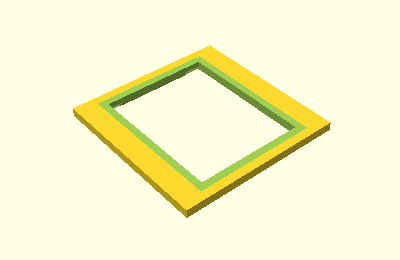
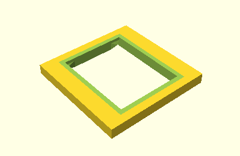

<!--This document was generated. Edit the source files under “resources/butty”, not this file.-->
# Tutorial: Butty the single-button keyboard (part 1)

This article is a beginner’s guide to the DMOTE application. It’s about getting
started designing your own keyboard from scratch, proceeding to a tiny but
usable original design for a keyboard case.

For installation instructions and a broader conceptual overview than the one
offered here, try the [introduction](intro.md).


Our example project in this tutorial is named Butty. Butty says hi.

## Running on empty

As our very first step toward designing Butty, let’s just see what happens
when we run the application without a keyboard design. This is the command to
do that:

`# lein run`

Here, `#` represents your prompt at your command line, where you type only
`lein run` followed by Enter. For this to work, your terminal must be in the
DMOTE application’s directory on your computer.

[Leiningen](https://leiningen.org/) runs the application, which creates a
couple of new files under `things/scad`, that is the `scad` folder inside the
`things` folder inside the application directory. One of the new files you have
created is called `body-main.scad`. If you open that file in
[OpenSCAD](https://www.openscad.org/), you see this view of your keyboard:


The file itself is not empty, but no model is visible. Butty is not yet born.

## The smallest configuration that shows something

We have learned that you can’t see anything when you run the application
without specifying a configuration. That is because the application has the
simplest possible built-in default configuration. This configuration actually
includes a single key for Butty, but shows no model because:

* The single key is placed at an elevation of zero. It disappears into the
  ground.
* The mounting plate for the key switch is 1 mm in size, but the key switch
  itself is of a real-world, ALPS-compatible type, larger than 1 mm. The
  mounting plate is therefore consumed by the switch it should support.

Let’s fix those problems now, by starting our project.

With a text editor, such as Vim or Notepad++, create a file called `butty.yaml`
in the project directory. Put the following text inside the file:

```yaml
key-clusters:
  main:
    anchoring:
      extrinsic-offset: [0, 0, 10]
by-key:
  parameters:
    plate:
      use-key-style: true
```

Mind the indentation. In [YAML](https://en.wikipedia.org/wiki/YAML),
indentation is the main form of structure. The words will be explained below.
First, run the application with that file as your configuration:

`# lein run -c butty.yaml`

This recreates `body-main.scad`. If you have it open in OpenSCAD, you now see this:



⤤ That’s a mounting plate for a single key. It will be the heart of Butty.

Each part of the YAML file you have created helps Butty in the following way:

`key-clusters` → `main` → `anchoring` → `extrinsic-offset` is a parameter. It
is nested, three deep, in sections of parameters. The way we use it here, it
elevates the main key cluster by 10 mm, which is more than enough to clear the
ground. The key cluster’s name (`main`) is built into the application. Options
for anchoring are explained [here](options-anchoring.md).

`by-key` → `parameters` → `plate` → `use-key-style` tells the application to
base the size of each key mounting plate on the style of the key, so that the
plate is large enough for an ordinary 1 u keycap and mechanical switch. We have
not explicitly defined a key style in `butty.yaml`, but again, there is one
built in. By the way, the `by-key` section got its name because it allows you
to make exceptions for specific parts of the keyboard, as detailed
[here](options-nested.md). We’ll be doing that later.

## Using the bundled base

You might wonder why `use-key-style` isn’t always on. The application generally
leaves `false` as the default value for Boolean (i.e. `true` or `false`)
parameters. This is mainly for consistency. In the case of `use-key-style` for
mounting plates, you may one day need an odd size to fit a custom rotary
encoder or some other unusual feature.

There is a bundled configuration file to serve as a foundation for fairly
normal keyboards. Let’s try adding it to Butty, by referring to it before our
own:

`# lein run -c config/base.yaml -c butty.yaml`

In this call, the application starts from its built-in defaults (the invisible
keyboard), then overrides some of that configuration with the bundled base
(`config/base.yaml`), and then finally applies `butty.yaml` on top of both.
We’ll be using this command to run the application throughout the rest of this
tutorial.



There is a visible difference: The mounting plate is now thicker. This is
because, among other useful properties, `base.yaml` contains the value 2 for
`by-key` → `parameters` → `wall` → `thickness`. That makes the case a sturdy 2
mm thick, whereas the built-in default is 1 mm, and we have no override in
`butty.yaml`.

## Simplification

`base.yaml` activates `use-key-style`, so we no longer need that parameter in
`butty.yaml`. Let’s remove it:

```yaml
key-clusters:
  main:
    anchoring:
      extrinsic-offset: [0, 0, 10]
```

Save `butty.yaml` with those shorter contents, then run the application,
repeating the last command to do so. The output will be the same as before
because the setting we removed from `butty.yaml` was made superfluous by the
addition of `base.yaml`.

This kind of simplification is good for maintenance. If you want to have two
kinds of Butty later on—perhaps a two-button Tutty model—you can maintain the
alternate version as yet another separate file that comes after `butty.yaml`
and duplicates nothing in `butty.yaml`. That is how the bundled configurations
work. The application never changes the contents of a configuration file.

## Summary

In this tutorial, we have learned:

* How to run the application and view the results.
* How to get something to show up by creating a configuration file.
* How to combine multiple configuration files, including a bundled one.
* To keep it simple.

In [part 2](tutorial-1b.md), we’ll add walls.
