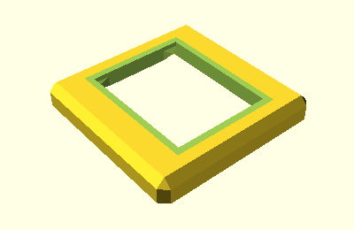
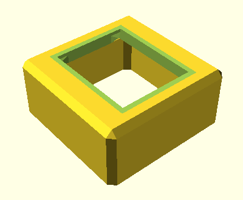
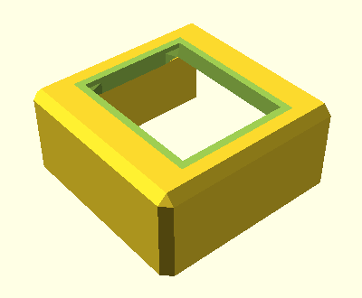

<!--This document was generated. Edit the source files under “resources/butty”, not this file.-->
# Tutorial: Butty the single-button keyboard (part 2)

This article continues from [part 1](tutorial-1a.md) and discusses walls.

At the end of part 1, Butty was a mounting plate for a switch, and nothing
more. We want more support: Enough material around the plate to have it stand
on a desk, with a switch in it, without falling over.

## A bevel around the mounting plate

We will begin with a point of aesthetics. Rather than adding a wall straight
down from the edges of the plate to the floor, we’ll add a bevel around the
plate. Change `butty.yaml` to contain this:

```yaml
key-clusters:
  main:
    anchoring:
      extrinsic-offset: [0, 0, 10]
by-key:
  parameters:
    wall:
      extent: 1
```

Default `extent` is 0. The parameter is documented [here](options-nested.md).

The command to run the application is, and will continue to be:

`# lein run -c config/base.yaml -c butty.yaml`

Here’s `body-main.scad` with the new configuration:



A bevel has appeared, lining the edge of the keyboard. Here’s how it works:

The keyboard case extends from each key mount. At the edge of a key cluster—as
on every side of Butty—there is a wall. This wall was at `extent` 0, meaning
the edge of the mounting plate, so we couldn’t see it.

Walls are built one segment at a time. Segments are points in space around the
key mount. Segment 0 is a corner of the plate itself. The position of segment
1, relative to segment 0, is determined for us in `base.yaml`, the bundled base
configuration file.  Here’s an excerpt from `base.yaml`:

```yaml
    wall:
      segments:
        "1":
          intrinsic-offset: [0,  1, -1]  # Top bevel.
```

This setting means that segment 1 is 1 mm out from each corner of Butty, and 1
mm down. By connecting each corner with a point off that corner at those
coordinates, in a rotating frame of reference specific to each side, we get a
bevel all the way round.

## Bringing the wall to the ground

Change `butty.yaml` to have the following contents, and run the application
again.

```yaml
key-clusters:
  main:
    anchoring:
      extrinsic-offset: [0, 0, 10]
by-key:
  parameters:
    wall:
      extent: 1
      to-ground: true  # New line!
```



⤤ The wall of the keyboard case now extends vertically from the segment
specified by our setting for `extent` all the way to the ground at z-coordinate
0. The total height of the case is 10 mm, given by our `extrinsic-offset`.

You see there is still room inside the case for a key switch. You could print
this version of Butty, mount a switch in it, and click away to your heart’s
content.

## An opening to the north

Butty is a single-button keyboard, but even a single-button keyboard needs more
parts than just a button. In order to send signals to a computer, Butty needs a
microcontroller. We will be adding one of those in part 3. For now, we’ll
prepare by opening up a hole in the wall on Butty’s back side.

We do this by specifying exceptions to the settings we have already made.

```yaml
key-clusters:
  main:
    anchoring:
      extrinsic-offset: [0, 0, 10]
by-key:
  parameters:
    wall:
      extent: 1
      to-ground: true
  sides:
    NNE:
      parameters:
        wall:
          extent: 0
          to-ground: false
    NNW:
      parameters:
        wall:
          extent: 0
          to-ground: false
```

In this version of `butty.yaml`, the `by-key` section has both `parameters` for
the whole keyboard and two other sets of `parameters`: One for each corner at
Butty’s back.

The wall we have seen so far is drawn between eight sides of Butty, designated
by eight intermediate points of the compass. By providing exceptions for the
“north by northeast” and “north by northwest” sides, restoring default settings
for those sides alone, we break the wall where we want to. The metaphor of the
compass is explained [here](configuration.md).



It’s a clean cut. Here’s another angle:


## Summary

In this part of the tutorial, we have learned:

* How to make walls with `extent` and `to-ground`.
* How to target the sides of a key: Using the names of compass points.
* How to make exceptions.

In [part 3](tutorial-1c.md), we’ll add a microcontroller.
