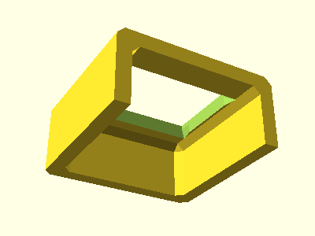
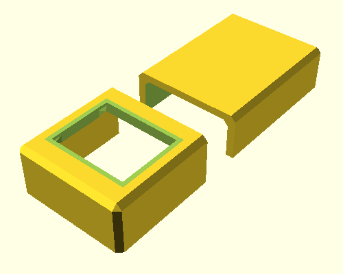
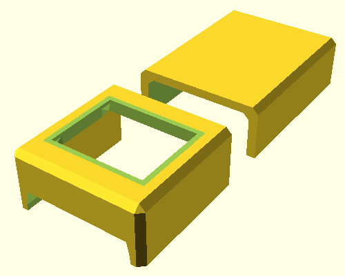
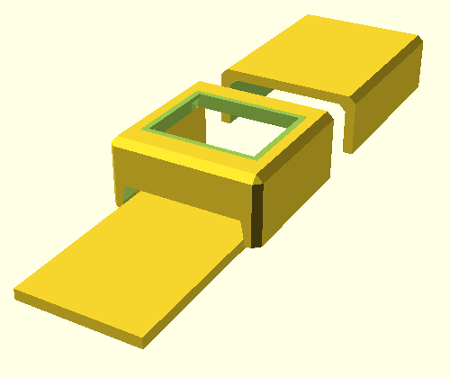
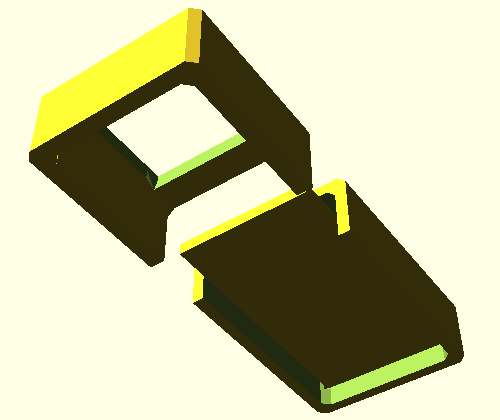
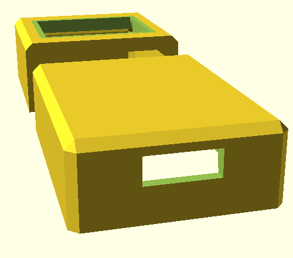

<!--This document was generated. Edit the source files under “resources/butty”, not this file.-->
# Tutorial: Butty the single-button keyboard (part 3)

This article continues from [part 2](tutorial-1b.md) and discusses
microcontrollers.



⤤ At the end of part 2, Butty was this box with three open sides: An irregular
hole in the top for mounting a switch, a hole in the bottom for soldering
access, and a hole in the back, which we had just opened, for adding a
microcontroller unit, also known as an MCU.

## A rear housing for the MCU

Change `butty.yaml` to contain this:

```yaml
key-clusters:
  main:
    anchoring:
      extrinsic-offset: [0, 0, 10]
by-key:
  parameters:
    wall:
      extent: 1
      to-ground: true
  sides:
    NNE:
      parameters:
        wall:
          extent: 0
          to-ground: false
    NNW:
      parameters:
        wall:
          extent: 0
          to-ground: false
main-body:
  rear-housing:
    include: true
    anchoring:
      extrinsic-offset: [0, 32, 0]
    size: [22, 30, 9]
    thickness:
      walls: 1.5
      roof: 1.5
```

Run the application, as usual:

`# lein run -c config/base.yaml -c butty.yaml`

The result, in `body-main.scad`, is a new piece of Butty behind the key
mounting plate.



This new piece is the rear housing (`rear-housing`). It’s just one way to make
room for an MCU and not a particular subject of this tutorial. You can read
more it about [here](options-main.md).

## The MCU itself

Add the following lines at the very bottom of `butty.yaml`, and run again:

```yaml
mcu:
  include: true
```



⤤ Where is the MCU? You can’t see it. Instead, there’s a new hole in Butty’s
front, to about a third of the way up the south wall.

The reason why we cannot see the MCU is not the same as the reason we could not
see Butty at first, in part 1 of this tutorial. The MCU is there in the model,
but it’s not in the rear housing yet, and it’s not being rendered. Try adding
another line to the `mcu` section, just to see what’s going on:

```yaml
mcu:
  include: true
  preview: true
```



⤤ That low, flat thing poking out of the new hole in the front is the MCU’s
circuit board. Inside the keyboard case, it has a small USB connector on the
far end, directly under the middle of Butty’s single key mounting plate, that
is at xy-coordinates `[0, 0]`.

If you have the file open in OpenSCAD’s preview mode, the board is a different
colour from the case because you can’t print a working MCU on an FDM printer.
It’s only showing up now for a visualization of how Butty is going to look
*after assembly*, hence the name of the setting, `preview`. Non-printability is
the reason why `preview` is disabled by default, and should be disabled before
you print.

## Moving the MCU to the rear housing

The hole over the MCU—the only thing we saw without `preview`—is made by the
DMOTE application to provide room for the components on the circuit board.
However, the MCU will do no good where it is. We want it inside Butty, safe
from dust and poking humans.

Let’s move the MCU. Change just the `mcu` section again in `butty.yaml`, adding
an `anchoring` subsection to it.

```yaml
mcu:
  include: true
  preview: true
  anchoring:
    anchor: rear-housing-interior
    side: N
    segment: 1
    extrinsic-offset: [0, 0, -3]
```

⤤ This is similar to the `anchoring` section for the `main` key cluster in
Butty’s configuration, but it’s more detailed. We have specified that the MCU’s
position should be based on the rear housing’s position: Its `anchor` is the
automatically defined name `rear-housing-interior` instead of the implicit
default `origin` of the coordinate system.

⤥ The result is to put Butty’s MCU inside the rear housing.



As a side effect, there is no longer a hole in the front.

Now that the MCU is in a reasonable place, we no longer need to preview it, so
you can remove the line that sets `preview: true`. Running without it, here’s a
view from the back:



⤤ With the MCU in its proper place and the preview disabled, there is now room
for a micro USB port in Butty’s back.

That hole for a USB connector is not part of the rear housing itself. It’s part
of the MCU, and specifically of the default type of MCU, which is a Pro Micro.
The `anchoring` settings now in `butty.yaml`, together with the precise
settings for the `rear-housing`, put that hole through the back wall. After
all, you will need to connect the MCU to your computer.

## Summary

In this part of the tutorial, we have learned:

* How to include a rear housing.
* How to include an MCU.
* How to preview a non-printable part of the keyboard.
* How to anchor one part to another part to good effect.

In [part 4](tutorial-1d.md), we’ll tweak the case.
